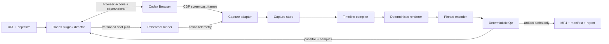

# Architecture: Recordly Codex

## Decision in brief

Recordly Codex is a **local Codex desktop plugin plus a local, headless recording engine**. Codex is the director: it turns a supplied URL and objective into a constrained shot plan, rehearses it in the Codex Browser, asks for any required approvals, and judges sampled output. Deterministic software captures, composes, and encodes media; frames are never routed through model context.

This deliberately borrows no Recordly implementation. Recordly demonstrates the useful product vocabulary—cursor polish, automatic zoom suggestions, styled frames, and MP4/GIF export—but is an AGPL-3.0 desktop application with its own capture/editor pipeline ([repository](https://github.com/webadderallorg/Recordly), [license](https://github.com/webadderallorg/Recordly/blob/main/LICENSE.md)). See [licensing.md](licensing.md).

## Scope and success criteria

The first supported workflow is a public or pre-authenticated browser site. Given a URL and a bounded objective, the plugin returns a 1080p MP4, a sanitized manifest, and a QA report without opening another visible application.

It must:

- use the Codex desktop Browser for interaction and Chrome DevTools Protocol (CDP) screencast frames;
- maintain a fixed browser viewport and recorded, replayable action telemetry;
- produce deterministic output for identical capture inputs, configuration, and renderer version;
- never silently approve sensitive actions, exfiltrate captured page data, or persist credentials in artifacts;
- fail closed when capture cadence, policy, navigation scope, or QA gates are not met.

Out of scope for v1: system audio, webcam, recording arbitrary native windows, CAPTCHA avoidance, authentication automation, arbitrary upload/download, and autonomous purchases, publishing, deletion, or permission changes.

## Component boundaries



| Module | Owns | Must not own |
| --- | --- | --- |
| `plugin-director` | Intake validation, plan generation, policy/approval handoff, retry choice, user-facing result | frame storage, pixel transformation, direct shell commands |
| `browser-adapter` | Codex Browser capability calls, read-only observation shaping, CDP session lifecycle | credentials, renderer state, unbounded page text passed to the model |
| `rehearsal-runner` | Execute a declarative plan once; emit actions, waits, navigations, viewport changes | deciding to weaken policies or re-plan mid-take |
| `capture-adapter` | `Page.startScreencast` intake, ACKs, timestamping, bounded spool | semantic planning or video composition |
| `capture-store` | Atomic session directories, hashes, retention, redaction metadata | source traversal outside session root |
| `timeline-compiler` | Convert normalized events into immutable render timeline/zoom/cursor tracks | page or browser access |
| `renderer` | Pure compositing of frames and timeline into numbered RGB/RGBA frames | network, browser, model, shell |
| `encoder` | Invoke a pinned encoder with argument-array allowlist; validate output | interpretation of input URLs or page contents |
| `qa-runner` | Technical checks and deterministic sampled-frame checks; classified retry reason | browser mutation or bypassing failed gates |

The plugin and engine communicate through a local, versioned RPC/CLI contract on a per-session Unix-domain socket (or named pipe on Windows). The engine binds no TCP listener. Every request carries `schemaVersion`, `sessionId`, `requestId`, and a canonical `artifactRoot`; unknown fields and versions are rejected.

## Core contracts

### Intake and plan

```ts
type RecordingRequest = {
  schemaVersion: 1;
  requestId: string;
  url: string;
  objective: string;
  viewport: { width: 1440; height: 900; deviceScaleFactor: 1 };
  output: { width: 1920; height: 1080; fps: 30; format: "mp4" };
  policy: { allowPrivateOrigin: boolean; allowedOrigins: string[]; maxAttempts: 2 };
};

type ShotPlan = {
  schemaVersion: 1;
  planId: string;
  sourceUrl: string;
  allowedOrigins: string[];
  shots: Array<{
    id: string;
    goal: string;
    steps: BrowserStep[];
    expected: Assertion[];
    maxDurationMs: number;
  }>;
  approvalsRequired: ApprovalRequirement[];
};
```

`BrowserStep` is declarative (`navigate`, `click`, `type`, `scroll`, `waitFor`, `assertVisible`, `capturePause`). It accepts selectors or semantic targets resolved by the Browser adapter, never page-provided executable code. The director treats visible webpage content as untrusted data, not instructions.

### Event envelope and telemetry

All time is monotonic microseconds (`tUs`) since `capture_started`; wall clock is stored once for audit only. Event files are newline-delimited JSON, one canonical object per line.

```ts
type SessionEvent = {
  schemaVersion: 1;
  sessionId: string;
  seq: number;                 // strictly increasing
  tUs: number;
  type: "frame" | "pointer" | "click" | "scroll" | "navigation" |
        "viewport" | "marker" | "capture_health";
  data: Record<string, unknown>;
};

type FrameEvent = SessionEvent & { type: "frame"; data: {
  cdpSessionId: number; frameId: number; receivedAtUs: number;
  imagePath: string; sha256: string; width: number; height: number;
}};

type PointerEvent = SessionEvent & { type: "pointer"; data: {
  x: number; y: number; buttons: number; source: "planned" | "observed";
}};

type ClickEvent = SessionEvent & { type: "click"; data: {
  x: number; y: number; button: 0 | 1 | 2; targetLabel?: string;
}};
```

`targetLabel` is optional, redacted, and capped at 120 characters. Raw DOM, keystrokes, cookies, authorization headers, full URLs with query strings, and response bodies are excluded from telemetry.

## Capture and timing

1. Pin viewport, device scale factor, browser zoom, color profile, and reduced-motion preference before rehearsal. Record them in `environment.json`.
2. Run the plan in rehearsal mode. It validates assertions and emits the exact resolved actions, but does not write frames. A changed origin, blocked action, unhandled dialog, download/upload, permission prompt, or unapproved sensitive action ends the run.
3. Start the screencast immediately before the accepted take. For each CDP `Page.screencastFrame`, timestamp at receipt, write atomically to `frames/raw/`, then ACK immediately after durable enqueue. Capture is a bounded producer/consumer pipeline: a 120-frame memory queue, one disk writer, and per-frame health counters.
4. If queue occupancy exceeds 80%, request lower screencast quality/scale once; above 95%, or if any ACK exceeds 500 ms, abort as `capture_backpressure` rather than make a silently uneven video. Never drop an event without logging it.
5. Emit planned cursor events at action dispatch, plus observed browser-coordinate pointer events where available. Transform only after capture from browser CSS pixels into source-frame pixels; preserve both coordinate spaces.
6. Stop capture after the final `capturePause`, flush, hash the immutable raw inputs, and compile the timeline.

### Frame-rate normalization

CDP screencast delivery is variable. The renderer has a fixed output grid `n * 1_000_000 / fps`. For each output time, select the newest source frame with `frame.tUs <= output.tUs`; duplicate it until a newer frame exists. Do not interpolate webpage pixels. Mark a capture invalid when the longest inter-frame gap during an active shot exceeds 500 ms, or when fewer than 80% of expected 30 fps slots have a distinct source frame. Holds deliberately requested with `capturePause` are exempt.

This produces a reproducible constant-frame-rate stream while preserving the audit trail of actual capture cadence.

### Cursor, click, and auto-zoom tracks

- Use planned action positions as authoritative click intent; use observed pointer telemetry for travel. Smooth only the rendered overlay with a cubic Hermite spline, clamped to actual event bounds. A click adds a 180 ms scale pulse and optional 240 ms ripple.
- Hide the browser-native cursor only when the Browser/CDP capture mode proves it absent. Otherwise disable the synthetic cursor to avoid a double cursor.
- Candidate zooms come from explicit shot markers and clustered meaningful events: click, focused type target, or a scroll settling point. Ignore events within 800 ms of navigation and candidates closer than 1.2 s.
- A candidate centers on the target/pointer, clamps to source bounds, has max 1.65x zoom, 300 ms ease-in/out, and must keep a 12% source-frame safety margin. Resolve overlaps by priority: explicit marker > click > type > scroll. A deterministic score records why every chosen candidate won.
- Default output frame is a 16:9 canvas with a neutral background, 48 px logical padding, rounded source frame, and fixed shadow. Design presets are versioned JSON; they contain no executable code.

## Retry and QA loop

The director can retry **one failed shot**, then render a new complete take. It may change waits, selectors, and shot boundaries; it may not expand allowed origins, approve an action, or enter credentials. Maximum is two complete attempts unless the user explicitly raises it.

| Gate | Failure handling |
| --- | --- |
| Plan/rehearsal assertions | retry one affected shot after replanning; otherwise return diagnostic, no render |
| Capture health/cadence | retry complete take once; never repair missing intervals by invented pixels |
| Renderer/encoder | retry deterministic command once only for a transient local error; preserve failed logs |
| Technical QA | retry only when a classified root cause maps to plan/capture; otherwise fail with samples |
| Visual policy QA | use model review of redacted, downscaled contact sheet only; fail closed on possible secret/PII or broken state |

Technical QA checks duration, CFR metadata, decoder readability, frame count, output dimensions, first/last-frame blackness, frozen-frame runs, source-to-output hash manifest, and sampled pixel bounds. Visual QA samples start, each marker, each click, every 5 seconds, and end; it checks cursor visibility, crop safety, zoom target inclusion, modal/error pages, and known sensitive-data patterns. Any automated visual inference is advisory except the redaction gate, which is conservative.

## Artifact layout and retention

```
artifacts/<session-id>/
  request.sanitized.json        # no credentials/query values
  plan.json                     # immutable accepted plan
  environment.json
  telemetry.ndjson
  frames/raw/000001.webp
  timeline.json
  render/frames/000001.png      # optional; remove after successful encode by policy
  output/recording.mp4
  qa/report.json
  qa/contact-sheet.jpg
  manifest.json                 # hashes, versions, provenance, retention expiry
  logs/engine.ndjson
```

Session paths are generated IDs, never user-controlled. File writes use `openat`-style containment checks (or equivalent), restrictive permissions, atomic temp-and-rename writes, size quotas, and explicit MIME validation. Default retention is 24 hours for raw frames and seven days for final outputs; private captures default to no retained raw frames after successful QA. Cleanup is explicit and logged.

## Test pyramid and red/green workflow

Every behavioral change starts with a failing test. The narrowest test turns green first; refactoring follows only with the suite green.

| Layer | What it proves | Examples |
| --- | --- | --- |
| Unit (largest) | Pure, deterministic behavior | event ordering, timestamp grid, coordinate transform, zoom selection/ties, redaction, path containment, encoder argument construction |
| Contract | Stable boundaries | JSON schema acceptance/rejection, RPC versioning, Browser adapter recorded fixtures, CDP event fixture ingestion |
| Integration | Local pipeline | fixture screencast + telemetry to known MP4; FFprobe metadata; bounded queue behavior; no network renderer test |
| End-to-end (smallest) | User-visible contract | local static demo site, rehearsal, capture, render, QA, exact artifact manifest; approval-denied path |
| Security/regression | Safety properties | hostile page text never becomes a tool call, secret tokens absent from artifacts/logs, symlink/path traversal rejected, unapproved upload/download blocked |

Golden fixtures use synthetic/public pages and generated images only. Commit contact sheets and metadata hashes, not raw production captures. CI runs unit/contract on every change; integration on supported OS runners; E2E against a local static fixture; release candidates additionally run deterministic render comparison on the supported desktop platform.

## Explicit implementation assumptions and open risks

- This design depends on Codex desktop Browser continuing to expose CDP screencast access. A capability probe is a release-blocking acceptance test, not a one-time assumption.
- CDP screencast has no audio guarantee. v1 exports silent video by design; audio needs a separately consented architecture.
- “No human intervention” means no human interaction for a pre-authorized, non-sensitive workflow. Browser and platform permission controls still govern the session.
- Page animation, cross-origin redirects, service worker timing, and anti-bot controls make a universal arbitrary-site promise unsound. The plugin should report an explicit blocked state, not attempt evasions.
