# Architecture

## Operating model

Recordly Codex is a local Codex Desktop Browser plugin. The model plans and judges a bounded workflow; deterministic local code owns capture evidence, timing, rendering, encoding, and quality checks. The model receives artifact paths and compact status, never raw frame streams.

```mermaid
flowchart LR
  I["Approved URL + objective"] --> M["Ten-tool local MCP service"]
  M --> H["Per-session Browser helpers"]
  H --> B["Codex Desktop Browser host"]
  B -->|"loopback only"| C["Capture broker"]
  C --> E["Private frame + receipt evidence"]
  E --> S["Seal gate"]
  S --> R["Deterministic render + FFmpeg"]
  R --> D["MP4 + manifest + quality report"]
```

The Browser host, not MCP, runs the helpers. It must expose `browser_run_code_unsafe`. The helpers use only the active page object and a loopback endpoint; they do not need Node imports, filesystem access, process access, or a model-visible data channel.

## Session contract

`create_recording_session` accepts `url`, `objective`, and optional `allowedOrigins`/`allowPrivateOrigin`. The service fixes the viewport at 1440×900 and delivery profile at 1920×1080, 30 fps, silent MP4 with bounded attempts. It creates a private session root, broker, capture configuration, and two generated helper entrypoints.

The other capture-session tools are:

| Tool | Purpose |
| --- | --- |
| `record_browser_event` | Append model-described semantic `pointer`, `click`, `scroll`, `navigation`, `viewport`, or `marker` evidence. The service assigns session ID, sequence, and monotonic timestamp. |
| `inspect_recording_session` | Return redacted status and contained paths. |
| `seal_recording_capture` | Require complete capture evidence, render, encode, and return delivery artifacts only when approved. |
| `discard_recording_session` | Close the broker and remove the owned session and helper entrypoints. |

Frame and capture-health events are not MCP inputs. They are emitted by the local broker after a Browser helper posts an actual screencast frame.

## Editable project contract

Five additional tools operate after a quality-approved capture is sealed:

| Tool | Purpose |
| --- | --- |
| `create_recording_project` | Create a canonical versioned project from one approved sealed capture. |
| `inspect_recording_project` | Read the current project, revision, digest, and preview state. |
| `revise_recording_project` | Replace the complete project with a validated monotonic manual or bounded automated revision. |
| `render_recording_project_preview` | Render a preview for the exact current revision. |
| `render_recording_project_final` | Render a final only when the same current revision already has a matching preview. |

The project is the durable editing contract. It can reference approved capture sources and declare clip trims, speed ramps, cuts/crossfades, cursor/click evidence, zooms, annotations, captions, PiP, WAV audio, output quality, and explicit local render hooks. A new revision invalidates an older preview. Project creation, revision, and rendering are serialized by project ID with expected-revision/digest checks so stale operations cannot overwrite newer work.

An approved v0.2.0 sealed delivery can be migrated without recapture. The v0.3.0 reader accepts a missing cursor track as empty, derives project evidence from the private sealed manifest rather than a legacy `0644` capture-event log, and scales proportional legacy screencast frames to the sealed geometry. It rejects incompatible aspect/geometry, digest, containment, or permission evidence.

## Capture, timing, and privacy

The helper performs one claim for its session and receives a random capability token. The broker accepts JSON only from loopback, only for that session and approved origin, and rejects oversized or malformed frames. It writes a frame before the helper ACKs the CDP screencast frame.

At local broker receipt, each accepted frame is assigned `receiptOffsetUs`: zero for the first frame and strictly increasing thereafter. This is timing evidence created locally, not page data. Partial or legacy timing may remain inspectable, but cannot receive quality-approved delivery status.

Artifact roots are absolute, contained, owner-token protected directories. Browser helpers live separately in the Browser-approved bridge root. Raw frames, cookies, headers, raw DOM, and captured page text are excluded from MCP output, manifests intended for delivery, Git, and model context.

## Seal and delivery

Sealing requires a stopped capture summary with complete acknowledgements, no rejected frames, stable frame geometry, valid hashes, and complete broker receipt timing. The renderer creates a constant-frame-rate 1920×1080 H.264 MP4, probes it with FFmpeg tooling, samples opening/midpoint/final frames, checks for frozen evidence, then emits exactly:

1. `recording.mp4`
2. `recording-manifest.json`
3. `quality-report.json`

The delivery manifest includes origin, objective, aggregate evidence hashes, and quality provenance while omitting target path/query/fragment, credentials, and raw-frame paths. A receipt-timed, non-frozen capture is approved; a legacy-timed one is only a candidate.

The sealed-capture baseline deliberately stays conservative. The editable project renderer adds deterministic source-timed composition: trims, constant or ramped speed, cuts/crossfades, cursor and click effects from observed evidence, manual/automatic zooms, annotations, captions, PiP, WAV audio, and declared hooks. It emits MP4 or GIF with deterministic quality profiles; GIF rejects audio.

Capture frames, PiP, and audio are never trusted by a hash-then-reopen pathname flow. Rendering copies the exact bytes read from one opened, bounded regular file into exclusive private snapshots, verifies digest and media type, and makes FFmpeg or the compositor consume only those snapshots. Final publication also uses a verified private staging path and atomic publication. Temporary staging is removed on success or failure.

## Supported scope and live evidence

The final approved evidence exercised the local MCP service, one-time Browser-to-broker claim, bounded hero/scroll capture, receipt-timed rendering, and the three contained delivery artifacts against an authorized public workflow. Identifiers, paths, captured pixels, and hashes are intentionally not published.

Final v0.3.0 candidate acceptance exercised an authorized Recordly.dev hero-to-features capture, approved v0.2.0 sealed-delivery migration, project revision without recapture, preview, and final rendering through the supported Codex Desktop Browser path. Raw MCP exposed ten tools. The capture accepted and acknowledged 892 frames with zero rejected frames. The decoded MP4 preview was 1920×1080 at 30 fps for 29.533333 seconds; private evidence remained mode `0600`, and visual QA passed. Revision advanced from 0 to 1 without recapture, and the second preview and final had the same deterministic SHA.

That evidence proves one candidate workflow, not arbitrary web autonomy or a published installation. v0.3.0 still needs public release and clean marketplace-install verification. Browser/system audio capture, login, CAPTCHA, payment, uploads, downloads, browser permissions, cross-origin expansion, native windows, and irreversible side effects remain outside the supported autonomous workflow and stop for user direction.
