# Architecture

## Operating model

Recordly Codex is a local Codex Desktop Browser plugin. Codex plans, performs safe approved browser actions, and judges bounded preview evidence. Deterministic local code owns capture, receipt timing, persistence, rendering, encoding, and artifact checks. The model receives summaries and a bounded preview image, never raw frame streams.

```mermaid
flowchart LR
  A["Approved URL and objective"] --> S["Capture session"]
  S --> B["Codex Desktop Browser helpers"]
  B --> C["Loopback capture broker"]
  C --> D["Private frame and receipt evidence"]
  D --> E["Seal and quality gates"]
  E --> P["Versioned project"]
  P --> R["Preview render"]
  R --> I["Decode and inspect preview image"]
  I --> J["Digest-bound model judgment"]
  J --> F["Final render"]
```

The Browser host runs the generated helper entrypoints. The local MCP service does not drive a CLI or IDE browser, capture a native display/window, or substitute a desktop recording application. The library `CaptureAdapter` in `src/capture` is a unit-tested CDP intake helper for injected transports; it is not the shipped Desktop Browser capture path.

Project and preview orchestration helpers live beside the MCP session service (`mcp/session-store-project-ops.ts`, `mcp/session-store-broker.ts`). Sealed delivery encoding helpers live in `src/render/sealed-session-encode.ts`. Shared path containment primitives live in `src/safe/`. Project schema validation primitives and section validators live in `src/project/validation-primitives.ts` and `src/project/project-sections.ts`. Browser helper generation is split into typed request/observer/source modules under `mcp/browser-helper-*.ts`.

## Capture contract

`create_recording_session` takes an approved `url`, `objective`, and bounded capture limits. The canonical origin derives from the URL; there is no custom origin-set input.

Generated helpers are one-session entrypoints. They send browser-scoped screencast frames to a loopback broker, which durably writes each accepted frame before acknowledgement and assigns receipt offsets on a monotonic local clock. Trusted click and wheel-derived scroll evidence is narrow and broker-owned. `record_browser_event` may add planned semantic context, but it cannot manufacture observed action evidence.

Sealing renders only a stopped, complete capture. It fails closed on invalid timing, unapproved evidence, no decoded visible change, insufficient final hold, frozen frames, clipping, privacy, or media failures. A sealed delivery yields a deterministic MP4, manifest, and quality report.

## Project contract

The project stage has 15 tools in addition to the five capture tools. It supports canonical full-document revisions, profiles, private media import, editorial proposals, preview inspection, preview judgment, and final publication.

Projects are revisioned and digest-bound. A project may declare bounded trims, speed regions, cuts/crossfades, observed cursor/click effects, zooms, annotations, captions, imported image/video/audio assets, and constrained framing. It is not a GUI timeline or a Recordly-compatible project document.

`RECORDLY_CODEX_IMPORT_ROOT` configures one stable authorized import directory when the service starts. `import_recording_project_media` accepts only a project, exact revision, and bounded relative file name. The runtime copies the selected bytes into private storage, verifies type and SHA-256 identity, and exposes an opaque media ID. Audio is normalized to WAV. The tool never accepts a caller-selected root or arbitrary path.

Profiles are either fixed built-ins or owner-local strict snapshots. Applying one is a normal, explicit project revision. The built-ins cover landscape 1920×1080, square 1080×1080, and vertical 1080×1920 output.

## Editorial, preview, and final gates

`propose_recording_project_editorial` returns a canonical, evidence-backed proposal for the exact current project revision. Only `zoomProposals` can be applied, using `apply_accepted_recording_project_editorial` with the exact proposal digest and explicitly selected IDs. Review-trim proposals and transition suggestions are intentionally review-only.

Preview is a required evidence state, not a polite suggestion:

1. Render the exact current revision with `render_recording_project_preview`.
2. Call `inspect_recording_project_preview`; it decodes a bounded private copy and returns technical QA plus a three-frame contact-sheet image.
3. Judge that exact project and preview with `judge_recording_project_preview`, passing both SHA-256 digests returned by inspection. The verdict is immutable for that identity.
4. On `revise`, create a bounded new revision and repeat preview, inspection, and judgment. On `accept`, `render_recording_project_final` may render the exact current revision.

Final rendering checks that the preview is current and, for the V2 workflow, that the stored judgment is accepted and digest-matched. Any project revision makes previous preview and judgment evidence stale.

This permits a fully autonomous safe workflow: Codex can inspect and judge the evidence itself. It does not relax the hard stop gates for authentication, CAPTCHA, secrets, payments, sensitive uploads, permissions, or irreversible actions.

## Output and evidence boundaries

The renderer produces deterministic MP4 or GIF output. GIF excludes audio. Output-parity fixtures exercise preview and final at 1920×1080, 1080×1080, and 1080×1920 in both formats, then decode declared checkpoints for trim, speed, crossfade, reviewed zoom, cursor, click effect, frame style, caption, and annotation.

Those fixtures establish bounded clean-room renderer behavior. They do not establish pixel identity with Recordly, a live Codex Desktop Browser proof, or support for Recordly features outside this contract: native display/window/microphone/system-audio capture, GUI timeline editing, `.recordly` persistence, dynamic webcam capture and controls, broad wallpaper/background controls, or its wider export surface.
